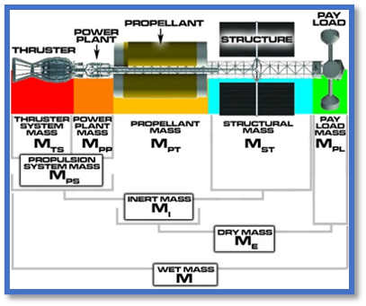
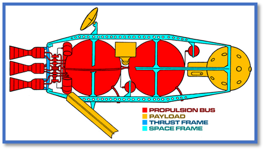

## Definition

Space Vehicles (_or often generally and inclusively called "Spaceships"_) are vehicle that do not have ground-contact as its primary movement component

<!-- <https://starwars.fandom.com/wiki/Starship> -->

## History

---

## Anatomy

Spaceships can be divided into several compartments based on largely three components (which is payloads, structures, and propulsion bus). 
Therefore, each components (that act as a super-section) have its own section which is the comparments.

**Payloads** are part of the spaceship that is its reason for existance.  
The compartments of a payloads are, but not exclusively limited to, 
flight control station, propulsion bus control station and maintenance center, astrogation station, accomodation, other decks, bays, and passages. 
This payload compartments are much more complicated than the next two, therefore this will be described in detail after them.

The base which payload stored or holded are called **structure**, which is the skeleton and skin of the spacecraft. 
Included in both Propulsion Bus and Payload Section. 
The compartments of structure are Frame (which divided into thrust frame and space frame), Armor, Shield, and Wing. 

The **propulsion bus** is … . 
This section includes Engine, Thruster, Power plant, Propellant, Fuel, Anchor

### Compartments

- flight and control Station
- ?wing
- ?docking port
- CIC
- engine deck
- Astrogation deck
- lobby (life support) deck
- sickbay deck
- emergency deck
- cargo hold
- hangar bay
- ?Artificial Gravity

### Components

---

## Main Classification

The Astrocosmos Space Authority use two category to classify spaceships. 
The first classification is based on their compartments, the second one is based on their roles.

**The main classification is based on the vessel's architecture (compartments)** rather than its physical size. 
This allows the same classification to be applied across different factions, species, and technologies, where vessels of the same type may differ considerably in size and capacity. 
However, observers may still use the typical size range as a practical field indicator when identifying an unfamiliar vessel.
The first classification, or **The Spaceships Main Classification divides ships into two supertypes: SpaceCRAFTs and SpaceSHIPs**. 

SpaceCRAFTs are space vehicles which have cockpits as its control deck. 
Therefore, most of spacecrafts lack compartments to be a classified as SpaceSHIPs and not often to be registered in air forces. 

Meanwhile, SpaceSHIPs are space vehicles which have command bridge/deck as its control deck.

However, based on the definition of spaceship in the summary, there is one more supertype: Space Semi-Stationary, 
which generally are space stations.

Spacecrafts includes all type of lightcrafts, gun ships, transports, and one type of cargo ships. 
Spaceship includes one types of cargo ships, all type of construction ships, carriers (and light carriers) and capitals (and light capitals). 
Semi-stationary includes all types of Mobile Stations and (fixed) stations.

[[/vehicles/spaceships/ship_classification.md|See here for the classification]]

## Spaceships (or Soon-to-be Universal) Secondary Classification

After a spaceships was made or classified mainly, it is not necessary to implement this second classification unless its role is explicitly and clearly intended by modifying some equipment and armament (maybe some components too but not compartments) to its existence. 

---